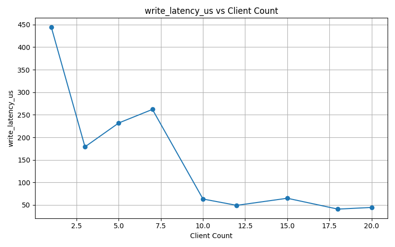

# Distributed Shared Memory System Report

## Introduction

The system consists of three main components: Master, Backup Master, and Slave servers, along with Client applications that interact with them. The system provides fault-tolerant key-value storage with consistency guarantees.

## System Architecture

The system follows a primary-backup architecture with the following components:

1. **Master Server**: The primary coordinator handling client requests and managing slave nodes
2. **Backup Master**: A hot standby that takes over if the primary fails
3. **Slave Nodes**: Data storage nodes that maintain key-value pairs
4. **Clients**: Applications that perform READ and WRITE operations

## Component Details

### 1. Master Server (`master/main.go`)

#### Key Responsibilities:
- Manages client connections and requests
- Coordinates with slave nodes
- Maintains consistency across the system
- Handles failover to backup master

#### Implementation Details:

The Master server implements several critical functions:

1. **Connection Management**:
   - Listens on port 12345 for incoming connections
   - Distinguishes between client and slave connections
   - Maintains lists of connected clients and slaves

2. **Key-Value Store Coordination**:
   - Uses a `KeyValueStore` struct to manage the distributed state
   - Tracks which slaves store which keys in `keyToSlaves` map
   - Implements a write-ahead log (`kv_store.log`) for durability

3. **Write Operations**:
   - Selects a quorum of slaves (ceil(n/2)) for each write
   - Uses random selection for load balancing
   - Waits for acknowledgments from slaves
   - Removes unresponsive slaves from the system

4. **Read Operations**:
   - Checks which slaves should have the requested key
   - Implements a read repair mechanism if needed
   - Uses majority voting for consistency when mapping is unavailable

5. **Fault Tolerance**:
   - Notifies backup master when it comes online
   - Handles slave failures gracefully

### 2. Backup Master (`backup_master/main.go`)

#### Key Responsibilities:
- Maintains a hot standby of the master
- Takes over if primary master fails
- Synchronizes state using the master's log file

#### Implementation Details:

The Backup Master extends the Master functionality with:

1. **Log-Based Synchronization**:
   - Monitors the master's `kv_store.log` file for changes
   - Loads initial state from the log on startup
   - Watches for updates to the log file

2. **Local Key-Value Cache**:
   - Maintains a `keyValueData` map with recent key-value pairs
   - Uses this for faster read operations when possible

3. **Connection Handling**:
   - Listens on port 12346 (different from primary master)
   - Can detect when primary master comes back online

### 3. Slave Nodes (`slave/main.go`)

#### Key Responsibilities:
- Store key-value data
- Respond to master commands
- Implement failover between primary and backup masters

#### Implementation Details:

1. **Connection Management**:
   - Implements exponential backoff when connecting to masters
   - Tries primary master first, then fails over to backup
   - Maintains persistent connections with ping/pong heartbeats

2. **Command Processing**:
   - Handles READ and WRITE operations from master
   - Maintains local `data_store` map
   - Implements timeout handling for connection health

3. **Fault Tolerance**:
   - Automatic reconnection logic
   - Session state management

### 4. Client (`client/main.go`)

#### Key Responsibilities:
- Provides user interface for READ/WRITE operations
- Implements failover between primary and backup masters
- Displays system status to users

#### Implementation Details:

1. **Connection Management**:
   - Attempts connection to primary master first
   - Falls back to backup master if primary unavailable
   - Clearly indicates which server it's connected to

2. **User Interaction**:
   - Simple command-line interface
   - Handles READ and WRITE operations
   - Displays results clearly

## System Operation Workflows

### Write Operation Flow:

1. Client sends WRITE command to master
2. Master:
   - Selects a quorum of slaves (ceil(n/2))
   - Logs the operation to disk
   - Sends WRITE command to selected slaves
3. Slaves:
   - Store the key-value pair locally
   - Send ACK back to master
4. Master:
   - Waits for ACKs from majority
   - Removes unresponsive slaves
   - Returns success to client

### Read Operation Flow:

1. Client sends READ command to master
2. Master:
   - Checks which slaves should have the key
   - If mapping exists, queries those slaves
   - If no mapping, queries all slaves and determines majority response
   - Updates its mapping based on responses
3. Returns value to client

### Failover Scenario:

1. Primary master fails
2. Clients and slaves detect failure via timeouts
3. Clients reconnect to backup master
4. Slaves reconnect to backup master
5. Backup master:
   - Takes over operations
   - Uses log file to maintain state
   - Continues normal operations

## Consistency Model

The system implements a quorum-based consistency model:

- **Write Quorum**: ceil((n+1)/2) slaves must acknowledge writes
- **Read Quorum**: Reads from enough slaves to ensure at least one has the latest value
- Uses version-less last-write-wins semantics

## Fault Tolerance Mechanisms

1. **Master Failover**:
   - Backup master takes over when primary fails
   - Clients and slaves automatically reconnect

2. **Slave Failure Handling**:
   - Master removes unresponsive slaves
   - Rebalances key assignments among remaining slaves

3. **Durability**:
   - Write-ahead logging on master
   - Replication to multiple slaves

4. **Connection Resilience**:
   - Exponential backoff in slaves
   - Ping/pong heartbeats

## Performance Considerations

1. **Write Optimization**:
   - Only requires majority acknowledgment
   - Random slave selection for load balancing

2. **Read Optimization**:
   - Caching in backup master
   - Direct queries to likely slaves

3. **Network Efficiency**:
   - Connection reuse
   - Minimal protocol overhead

## Limitations

1. **Single Point of Failure**:
   - While there's a backup master, the system can't handle simultaneous failure of both

2. **Memory-Only Storage**:
   - Slaves don't persist data to disk
   - Master log is the only persistent store

3. **No Atomic Operations**:
   - Basic READ/WRITE operations only
   - No transactions or complex operations

## Conclusion

This Distributed Shared Memory system provides a fault-tolerant, consistent key-value store with automatic failover capabilities. The primary-backup architecture with quorum-based replication ensures availability while maintaining reasonable consistency guarantees. The system demonstrates core distributed systems concepts including replication, failure detection, and consistency models in a practical implementation.

Each component plays a specific role in the system's operation, with clear interfaces between them. The use of Go's concurrency primitives (goroutines, channels, mutexes) enables efficient handling of multiple simultaneous connections while maintaining thread safety.

# Scaled Testing

### `test_harness/main.go`

To evaluate the scalability and performance characteristics of the distributed key-value system, we developed a custom **test harness** in Go. This harness is designed to simulate a real-world load by spawning multiple clients and slave servers, coordinating their activities, and collecting detailed runtime metrics for analysis.

#### **Key Features of the Test Harness**

1. **Configurable Setup**
   - The number of **clients** and **slave servers** can be controlled via command-line flags (`-clients`, `-slaves`).
   - Each client creates a pool of TCP connections to the master node, simulating concurrent interactions.

2. **Dynamic Load Generation**
   - Clients randomly perform **read** (GET) and **write** (PUT) operations on a uniform keyspace (`key0` to `key999`).
   - The **write percentage** (default 30%) controls the read-write mix.
   - Each operation is rate-limited using a small sleep to avoid overloading the system unrealistically.

3. **Metrics Collection**
   - The harness continuously collects the following per-second metrics:
     - Total and successful requests
     - Error count
     - Average read and write latencies (in μs)
     - Read/write distribution
     - Throughput (requests per second)
   - These metrics are logged into both CSV and JSON formats for offline analysis.

4. **Warm-up Phase**
   - A warm-up period (`5s`) allows the system to reach a steady state before actual measurements begin.

## Slave Load Distribution

### **Metrics by Slave Count**

#### **Throughput (Requests per Second)**
- **Description**: The number of requests the system can process per second.
- **What it means**: Throughput is a key indicator of system performance. Increasing throughput with additional slaves shows the system’s ability to handle more load.

#### **Average Read Latency**
- **Description**: The average time taken to complete a read operation.
- **What it means**: Lower latency is desired for quick retrieval of data. As slave count increases, the read latency should ideally stay constant or decrease.

#### **Average Write Latency**
- **Description**: The average time taken to complete a write operation.
- **What it means**: Like read latency, lower write latency indicates better performance. If this metric rises as slaves are added, it may indicate contention or resource saturation.

### **Metrics by Client Count**

#### **Throughput (Requests per Second)**
- **Description**: The number of requests processed per second by the system.
- **What it means**: A high throughput indicates a high-performing system, while a plateau or drop suggests that the system is unable to scale efficiently.

#### **Average Read Latency**
- **Description**: The average time taken for read operations.
- **What it means**: Increased read latency as client count rises typically suggests that the system is becoming slower as more clients access the data simultaneously.

#### **Average Write Latency**
- **Description**: The average time taken for write operations.
- **What it means**: Write latency should ideally remain constant or improve with more clients. A rise in write latency with an increasing number of clients could indicate that the system is under heavy load.

